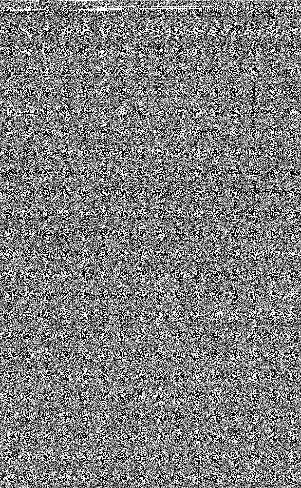

# FILE-2-BITMAP

Have you ever wanted to convert a file into a bitmap image? Well, now you can! This program will convert any file into a series of bitmap images. The images will be saved as .bmp files.

## Usage

```cargo run -- <input file> <output directory>```

## Example 

This a bitmap image from the zipped source code of this program:



## How it works

The program reads the input file as a byte stream. It then converts each byte into a 8-bit binary number. Each bit is then converted into a pixel. The pixels are then saved as a bitmap image. The program will continue to create new images until all the bytes have been converted, and the last image will be padded with zeros.

## Why?

I was bored and wanted to learn more about bitmap images. I also wanted to learn more about Rust. This program was a fun way to do both. 

## Coming Soon

A program that will convert a series of bitmap images back into the original file.
